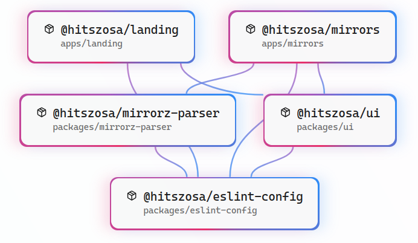

# HITSZ OSA Frontend

哈尔滨工业大学（深圳）开源技术协会前端 Monorepo。仓库统一维护协会门户、开源软件镜像站和共享 UI，使用 Bun Workspaces 与 Turborepo 管理依赖和任务。

## 工作区

| 工作区 | 包名 | 说明 | 生产地址 |
| --- | --- | --- | --- |
| `apps/landing` | `@hitszosa/landing` | 协会门户与动态内容站 | <https://www.osa.moe> |
| `apps/mirrors` | `@hitszosa/mirrors` | 开源软件镜像站前端 | <https://mirrors.osa.moe> |
| `packages/ui` | `@hitszosa/ui` | 共享品牌资产、主题、Tailwind 预设与 Astro 组件 | 内部包 |
| `packages/eslint-config` | `@hitszosa/eslint-config` | 共享 ESLint Flat Config | 内部包 |

两个应用都是 Astro 静态站点。`@hitszosa/ui` 是 Just-in-Time internal package，没有独立构建产物；应用构建时由 Astro/Vite 直接编译其源码。



正式内容统一存放在根目录 `content/`，按 `announcements`、`events`、`articles`、`services` 和 `friend-links` 分类。Landing 读取全部集合，Mirrors 只读取带有 `镜像站` 标签的公告；该目录已加入 Turbo 的全局构建依赖。

## 技术栈

- Bun 1.3+
- [Turborepo 2](https://turborepo.com/docs)
- [Astro 6](https://docs.astro.build)
- TypeScript
- Tailwind CSS 4
- Vue 3、Pinia（仅 Mirrors 的交互组件）
- ESLint、[Biome](https://biomejs.dev/guides/getting-started/)、[Sherif](https://github.com/QuiiBz/sherif)

## 快速开始

```bash
bun install
bun run dev
```

`bun run dev` 会通过 Turbo 同时启动 Landing 和 Mirrors。只开发一个应用时使用：

```bash
bun run dev:landing
bun run dev:mirrors
```

也可以只安装某个应用及其内部依赖：

```bash
bun install --filter @hitszosa/landing
bun install --filter @hitszosa/mirrors
```

## Mock 模式

所有工作区统一使用 `MOCK=true` 开关。默认命令不启用 Mock。

```bash
# 同时启动两个应用并使用本地 fixture
bun run dev:mock

# 只启动一个应用
bun run dev:landing:mock
bun run dev:mirrors:mock

# 构建可独立预览的 Mock 产物
bun run build:mock
bun run build:landing:mock
bun run build:mirrors:mock
```

Mock 模式的具体行为：

- Landing 从 `apps/landing/examples/content/` 读取示例公告、活动和文章；
- Mirrors 开发服务器直接响应 `apps/mirrors/mock/` 中的 JSON fixture；
- Mirrors Mock 构建只把 fixture 写入 `dist/`，不会修改 `public/`；
- `MOCK` 只接受 `true` 或 `false`，其他值会直接报错；
- 生产部署不得设置 `MOCK=true`。

Mirrors 的生产环境需要在站点同源提供：

- `/tunasync_status.json`
- `/static/res_link.json`

帮助列表在生产模式下从 `https://mirrors-help.osa.moe/help_list.json` 获取。

## Nix 构建

Flake 为 `aarch64-linux` 和 `x86_64-linux` 提供 `mirrors` 静态产物：

```bash
nix build .#mirrors
```

`result/` 的根目录就是镜像站部署目录。CI 使用相同产物并将文件描述符上限提高到 8192，以容纳 bun2nix 首次构建时的依赖缓存。

## 常用命令

| 命令 | 作用 |
| --- | --- |
| `bun run dev` | 同时启动所有应用 |
| `bun run dev:landing` | 只启动 Landing |
| `bun run dev:mirrors` | 只启动 Mirrors |
| `bun run build` | 执行质量门并构建所有应用 |
| `bun run build:landing` | 执行依赖任务并构建 Landing |
| `bun run build:mirrors` | 执行依赖任务并构建 Mirrors |
| `bun run check` | 运行 Astro/TypeScript 检查和 Sherif 工作区检查 |
| `bun run check:packages` | 只运行 Sherif |
| `bun run lint` | 运行全部 ESLint 任务 |
| `bun run format` | 使用 Biome 格式化源码 |
| `bun run format:check` | 检查格式但不修改文件 |

Turbo 的 `build` 任务依赖当前包的 `lint`、`check` 和上游包的 `build`。`MOCK` 已声明为 `build`、`dev`、`check` 的任务环境变量，因此生产与 Mock 模式使用不同的缓存键。

## 目录结构

```text
.
├── apps/
│   ├── landing/              # 协会门户
│   │   ├── examples/content/ # Mock 内容
│   │   └── src/content/      # 正式内容
│   └── mirrors/              # 镜像站前端
│       ├── mock/             # Mock JSON fixture
│       └── src/
├── packages/
│   ├── eslint-config/        # 共享 ESLint 配置
│   ├── mirrorz-parser/       # mirrorz-docs 加载、模板转换与 MDX 编译
│   └── ui/                   # 共享 UI、主题和品牌资产
├── vendor/
│   └── mirrorz-help/         # 锁定的上游实现与 zdoc/global 递归子模块
├── biome.json                # 根级 Biome 配置
├── bun.lock
├── package.json              # Workspaces、Catalogs 和根任务
└── turbo.json                # Turbo 任务依赖图
```

## 共享 UI

两站必须优先复用 `@hitszosa/ui`，避免在应用内建立第二套品牌、主题或站点框架。当前共享内容包括：

- `SiteHeader`、`SiteFooter`、`ThemeToggle`；
- OSA Logo 资产；
- 明暗主题初始化和持久化逻辑；
- 字体、颜色和语义设计 token；
- Tailwind 颜色、排版和交互变体预设。

应用的全局样式入口应保持以下结构：

```css
@import "@hitszosa/ui/styles/theme.css";
@import "tailwindcss";
@config "@hitszosa/ui/tailwind/preset";
@source "../../node_modules/@hitszosa/ui/src";
```

只有确实属于单个业务域的组件才保留在应用内。更多导出和主题用法见 [`packages/ui/README.md`](packages/ui/README.md)。

## Mirrorz Parser

`@hitszosa/mirrorz-parser` 是独立于 Astro、Vue 和 React 的帮助文档编译层。它负责：

- 按 `content/mirrors/help-overrides → vendor/mirrorz-help/zdoc/global` 顺序读取配置和 Markdown block；
- 合并 YAML 输入定义并保留 `option`、`boolean`、`text` 语义；
- 将 `{ztmpl}` block/inline role 转换为框架无关的 MDX 组件契约；
- 输出 MDX、模板表、全局变量初始值、TOC 和内部链接。

上游语义以 `vendor/mirrorz-help` 固定提交为准；`zdoc/global` 是其递归子模块。兼容性测试会加载 `src/routes.json` 中全部 157 个页面，并再次通过 MDX 编译器验证生成结果：

```bash
cd packages/mirrorz-parser
bun test
```

`apps/mirrors` 在构建期消费 Parser，并将帮助页发布到 `/help/<mirror>/`。`help:generate` 将上游文档与 `content/mirrors/help-overrides/<page-id>/` 中的本地增量合并，再把 MDX 和 manifest 写入 `apps/mirrors/generated/help/`；生成目录不纳入版本控制。覆盖目录可以只替换现有页面的个别配置或 block，也可以通过完整的本地 `zh.yaml` 和 block 新增页面。`dev`、`check`、`build` 及对应 Mock 命令都会先执行生成步骤，因此 Turbo 构建不会依赖手工准备产物：

```bash
cd apps/mirrors
bun run help:generate
bun run build:mock
```

桌面端帮助页使用固定镜像侧栏和独立滚动的文章区域；侧栏搜索框固定在顶部，镜像列表在侧栏内部滚动。主页镜像名称旁的帮助入口和共享顶栏均使用 `/help/` 站内路由。

## 依赖与配置管理

- 重复依赖版本集中在根 `package.json` 的 Bun Catalogs 中；
- 内部包使用 `workspace:*`；
- Sherif 检查依赖版本、字段顺序和工作区一致性；
- Biome 基础配置位于根 `biome.json`，各包只保留必要覆盖；
- ESLint 公共规则位于 `packages/eslint-config`；
- Tailwind 公共配置位于 `packages/ui/src/tailwind/preset.ts`。

更新依赖后至少运行：

```bash
bun install
bun run check
bun run build
bun run format:check
```

## 构建与部署

生产构建：

```bash
bun run build
```

部署目录：

```text
apps/landing/dist/
apps/mirrors/dist/
```

两个目录是独立静态产物，可以分别部署到不同域名。不要部署根目录，也不要部署 `build:mock` 生成的产物。

## 子项目文档

- [Landing 内容与开发说明](apps/landing/README.md)
- [Mirrors 开发说明](apps/mirrors/README.md)
- [共享 UI 使用说明](packages/ui/README.md)
