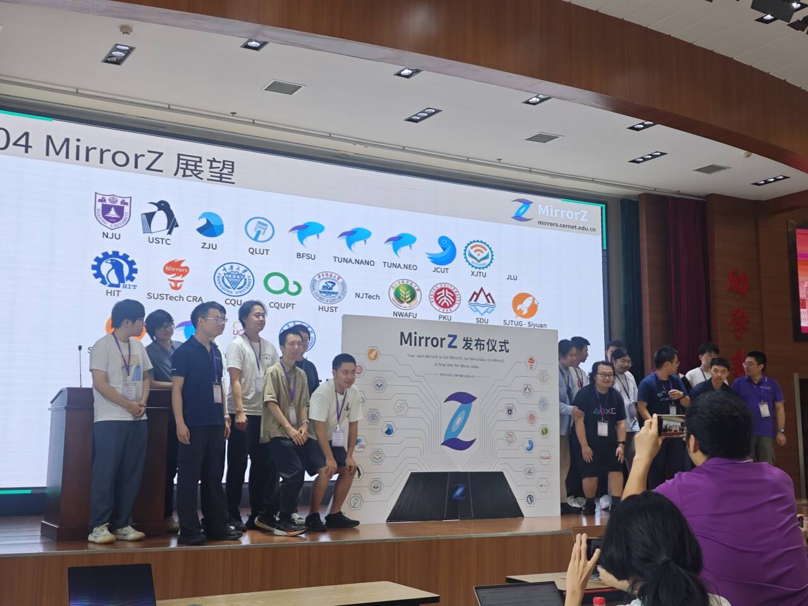

开源软件论坛由南京大学 e-Science 中心和人工微结构科学与技术协同创新中心主办，是一场汇聚各高校开源技术爱好者和其他相关人士的技术分享与交流会，内容包括但不限于开源软件、开源服务、开源组织、人工智能、高性能计算（HPC）等。

论坛始于 2023 年，每年举办一届，今年为第四届。我社曾于 2024、2025 年参加，今年是第三次参加此论坛。2026 开源软件论坛的日程为 8 月 21 日至 23 日，其中会议主体于 8 月 22 日举行。

我社本次与会成员有 _X1C_（主席）、_StrayRN_（主席）、_动量子_、_HighIQ666_、_Skyper_、_偏差认知了_、_Hiry_，共七名社员。

## 论坛一瞥

本次论坛汇聚了来自重庆大学、东南大学、北京交通大学、清华大学、中国科学技术大学、南京大学等高校的师生代表，以及来自河南省教育科研网、TexPage、Interact 等机构的从业者。他们带来了富有创新性、启发性和示范性的汇报与分享，引发了积极的提问与讨论。茶歇期间，各高校与会成员彼此交谈，氛围轻松活跃。

会议期间，令我印象最深刻的是重庆大学汇报人关于开源镜像站的分享。他针对目前流量过度集中于主流镜像站、负载较大，而其余高校镜像站知名度较低、资源闲置的现象，提出综合考量各镜像站的资源状况及其与用户的物理距离，实现合理路由的解决方案。他还在会上携手包括南京大学、中国科学技术大学、浙江大学、哈尔滨工业大学、重庆大学等在内的 25 个高校镜像站，发布 [**MirrorZ**](https://mirrors.cernet.edu.cn) 作为落地方案，并计划在未来与更多高校开源镜像站展开合作，为社会提供更多、更好的服务。

会议议程充实，开源精神在思想与成果的不断交流碰撞中凝练成形，连接着每一名与会者，并将具象化为一个个贡献，继续惠及整个社会。

很遗憾，哈尔滨工业大学（深圳）镜像站由于暂未向公网开放，未能进入首批支持名单。

## 烟雨南大

其实，设定上，此行的烟雨主要在南京市井中。不过如若南京大学也能习得我校“无界学城”精髓一二，倒也可将这整个南京城都容进校园版图内了。

在南京的这几天，本是奇热无比的。似是要证明其烟雨江南之名，在我们抵达南京的当天下午，便又抖抖威风，淅沥沥落起雨来。

不过第二天依旧要热化了……

江南水乡的水是我流不完的汗水。

## 尾声

感谢每一位与会的社员愿意抽出时间，在金陵一起度过这难忘的几天。

希望大家都能不虚此行，也希望未来有更多的社员一起参与到这样的收获之旅中。

## 碎碎念

会上很遗憾地得知，由于主办方 e-Science 中心面临经费危机，连续举办 4 年的开源软件论坛或许将难以迎来下一届。

不过这几天确实被主办方招待得很好，赞哦。

恰逢 8 月 22 日至 23 日为南京大学开学迎新之际，
能如此近距离感受其他高校的迎新氛围，也算是难得的经历。

*StrayRN，2026 年 8 月 23 日于有园*
