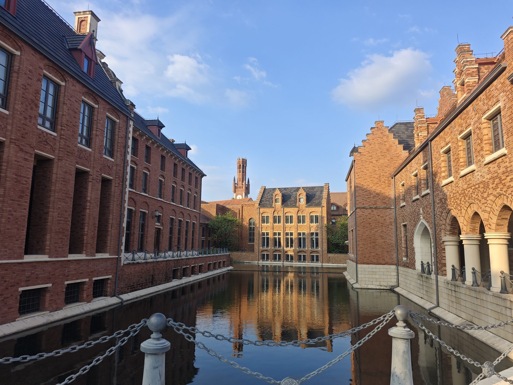
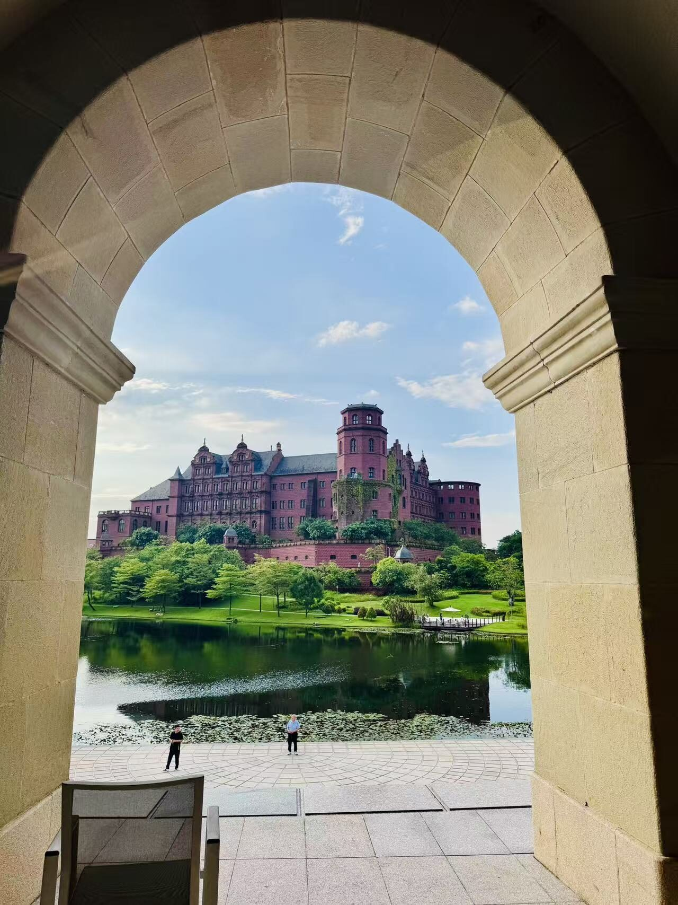
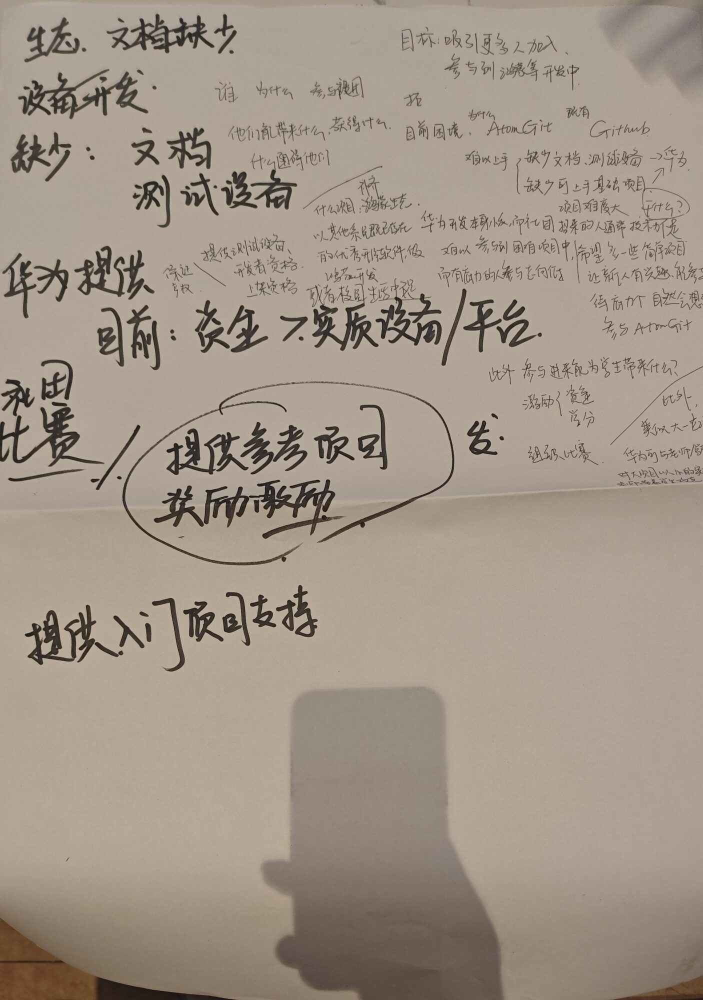

<RelatedLink
  href="../"
  description="华南区智能基座社团交流活动"
  label="前往溪村……"
/>

> 9 月 12 日，哈尔滨工业大学（深圳）华为“智能基座”社团社长 _XiC_ 与 _StrayRN_ 二人赴华为溪村，参加 2026 年华南高校“智能基座”学生社团运营研讨会。来自华南地区 9 所入选教育部—华为“智能基座”试点建设清单高校的师生代表齐聚一堂，围绕社团建设与开源生态展开深入交流。

这是有关于 [华南区智能基座社团交流活动](../) 一文的后记。

首先需要解答一个问题……

## 为什么是智能基座社团？

> “智能基座”产教融合协同育人基地是由教育部、华为于2020年底联合发起，首批布局72所高校。
旨在深化信息技术领域人才培养模式改革和协同创新，
着力构建以信息技术领域关键核心技术为基础的产业与人才生态。

简单来讲，就是华为联合学校创办的华为社团。本人就曾参加过哈工大本部的华为智能基座社团，还有幸在社团大会中抽中 _一塊華爲手錶_ 。（本部社团疑似举办了不少并没有在社团群内宣传过的活动）

但读者可能会疑惑：**智能基座社团和开源技术协会是什么关系**，为什么我们会代表智能基座社团参加活动，即使许多校友，甚至老社员们都没有听说过这个社团？其中的原因有一点微妙，而笔者其实也不是很清楚。早在2021年6月哈工深便与华为签约建立了智能基座社团，这个时间甚至早于开源技术协会正式成立。而不知何时何种原因，智能基座社团便被挂名在了开源技术协会之下。而开源技术协会的社员也便是智能基座社团的社员了。

虽然对于大多数同学来说这是个幽灵社团，但我们的确以智能基座社团的名义开展了一些活动，借由智能基座社团与华为展开了一些合作，_并得到了相应的资助_。

此行便是应华为邀请，在仇老师安排下前往松山湖，同各个高校智能基座社团进行交流。

## 松山湖

> 居然在东莞……

华为溪村坐落于东莞，园区以欧式风格打造，风景秀丽环境优美。

单看外表是光鲜亮丽，刷新了我对开发园区的认知，也难怪不建在寸土寸金的广州深圳了。

## 会谈

> 当日 14:00，各校代表在溪村 B 区门口集合，乘观光车进入园区，于溪村 B 区 B3 9410 咖啡厅享用了茶歇，并随即开启研讨会。

在进入园区前，和早到的两位同学进行了交流，了解到他们是来自深大计算机的大二大三生。深大的智能基座社团规模相对较大，有百余名成员，下设一个宣传部和四个技术部。而我只能尴尬回答我们这个草台的智能基座社团情况。（同时也拉进了我们开源技术协会的大群）

华为的茶歇还是挺丰盛的， _StrayRN_ 一直在强调他们的蓝莓味道有多正。也算是弥补了我们匆匆出门赶不及午饭的遗憾。

> 研讨会上，华为老师首先介绍了华南地区“智能基座”社团的工作总结与整体规划。华南区共有 9 所高校入选教育部—华为“智能基座”试点建设清单，包括广东工业大学、华南师范大学、深圳大学、桂林电子科技大学、暨南大学、中山大学、南方科技大学、华南理工大学以及哈尔滨工业大学（深圳），各校均派出学生与老师代表到场参会，大家首先进行了自我介绍。

我们和来自广工、桂电的同学以及刚好负责大学城片区的李老师一桌。李老师经常来大学城，性格很热情随和，尤其是在他发现认识我的导师之后，甚至还现场拍了照给我导发过去，这下知道我在外面不务正业了（

> 随后，老师介绍了华为的开源生态与 AtomGit 开源社区，涵盖终端鸿蒙、鲲鹏通算、昇腾智算三大开源生态技术体系，并分享了 2026 年中国大学生创新创业大赛产业赛道的 104 道华为命题——其中 100 道命题基于 openHarmony、openEuler、openJiuwen、openPangu 四大国产开源技术，另有华为云与 IoT-鸿蒙智家两类产业应用技术命题。

后来仇老师问我华为为何要推AtomGit，私以为华为只是依托于AtomGit建立所谓国产开源社区，实际上并无太多合作关系。不过确实可以感觉出他们对这个社区的重视程度。

## 讨论

讨论环节是比较有意思的，虽然我们的运营较差，但在糊弄过去我们的社团活动之后，我和 _StrayRN_ 也根据OSA、自身开发经验等进行了热烈的讨论，有较大的感悟和收获。

简单说下我们的几个观点：

1. 大一同学们的基础较差，也可能并不了解华为生态。现在的文档、教程都是较少的，门槛较高，并不利于新人参与社区；

2. 由于学业压力，同学们可能会更功利地去卷学习、参加加分政策内的竞赛，对于华为举办的这些竞赛和活动积极度很低（尽管有一定的奖金）。 广工的同学表示他们也遇到在校内宣讲openEuler和openJiuwen时的听众越来越少，积极性低的问题；

3. 大家接触华为生态较少。例如 _StrayRN_ 作为个人开发者收到过支持鸿蒙的请求，但由于缺少设备和鸿蒙用户偏少而难以支持。我的一个观点是与其开办大量活动或宣传，不如实际地给予一些硬件设备等。讲座的转化率是很低的，但如果个人或者社团内部有华为的设备，为了“不浪费”自然会去了解，进而参与到华为生态中。

## 关于开源

> 以下内容属 _XiC_ 个人观点，请嘲讽他的无知与怠惰，而非社团。

国产软硬件目前几乎没有不可替代性，至少对同学们来说是这样。大家原本在一个全球化的开源社区里活跃，这时有几家公司想要建立一个国内的开源社区，在大家眼里其实是一个倒行逆施的、封闭的行为。尤其是大量企业冷漠无视开发者意愿的态度，更给这个畸形的社区浇上一盆冷水。当我们在做国产开源社区的时候，到底想要的是什么？一个可以被企业汲取的血包，是“自主发展”的副产物，还是一个蓬勃发展的社区？

而作为校内的开源技术团体，虽然以“开源”自据，但我其实一直感觉社里缺少一点真正的开源宣传和开源精神，我们既没有更多地深入了解开源软件，也没有什么对开源社区的贡献。我也愧对于自己并不是一个真正的、可能也难以成为一个具有开源精神的开源贡献者。

之前在尝试寻找 selfhost 的问卷管理方案时，找遍了大量开源软件，无一不是所谓“开放核心”：企业将其软件产品的一部分开源出来，同时提供“商业”版本或附加组件作为专有软件。

> 开放核心的经典问题是，当上游社区想要实现专有附加组件中的一项功能时。
> 采用开放核心模型的公司或产品有动机阻止这种情况在上游开源项目中发生，因为专有代码依赖于该项目。
> [——What is open core?](https://opensource.com/article/21/11/open-core-vs-open-source)

当企业打着开源名义吸引技术开发者的时候，却只能逼着他们使用阉割过的版本。并且你早就知道，这些缺失的功能永远不会出现在roadmap里，也不可能允许你贡献：这些毫无技术壁垒的功能需要成为企业盈利的手段。

在我看来，这是某种施舍和对生态位的抢占，而算不得上是开源，甚至说是有毒的。至少不是有着开源精神的开源。（别误会，的确有着相当成功的开放核心，建立了繁荣的社区和传奇的开源软件。）而国产开源社区们……我在想，如果我们做出的开源产品，实际上并不是一个开放的、自由的产品；我们的社团，也逐渐变成了平凡的计算机与ai社团，我们还能背负得起“开源”二字吗？

最近社团内的小聚次数在变少，而运维工作都还是老人在主导，开发更是聊胜于无。想要找到愿意参与的人并不困难，但要让社员们更多的发挥主动性却是很棘手的问题。我也并不是像老社长们那样运营、技术能力都很强的人，但我感觉至少还是可以找来值得“相信智慧”的后人的（

在最近，我也有计划更多地开展一些活动，例如除 `Linux101` 之外更多、更深入的系列技术讲座；把一些社内服务开放给校内同学们……但这一切都需要社员们共同的努力。我们是一个开源团体，而这离不开所有人的贡献。

## 最后

华为的环境很好，餐食也相当不错（但据同学说华为的食堂很烂），虽然来回花了三四个小时，但确实不虚此行。

李老师和我们聊了很多关于未来的合作。或许在招新时你们会看到一张额外的印有华为的海报（没有说明鸽了）。

~~开源技术协会可能会倒闭，但应该不会变质。~~

\<\<EOF
