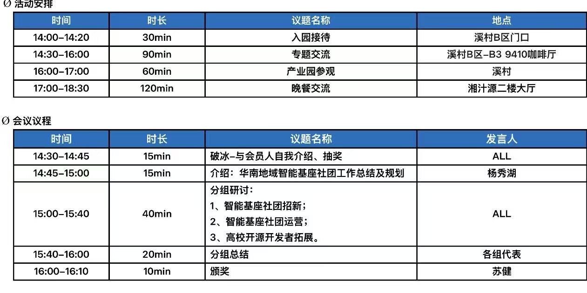
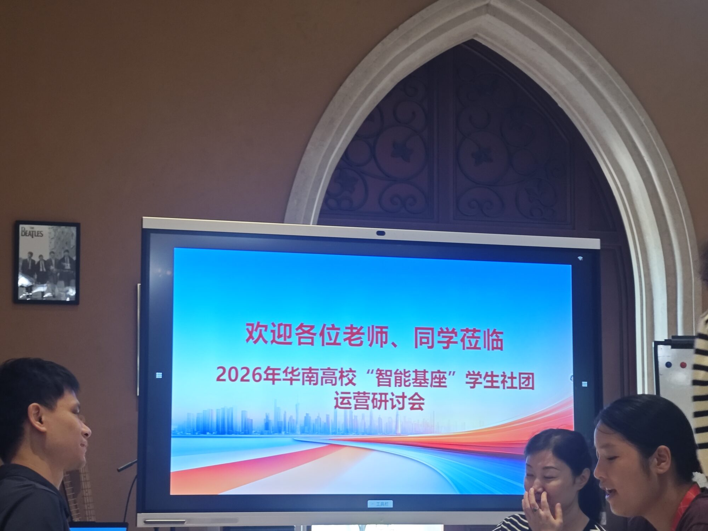
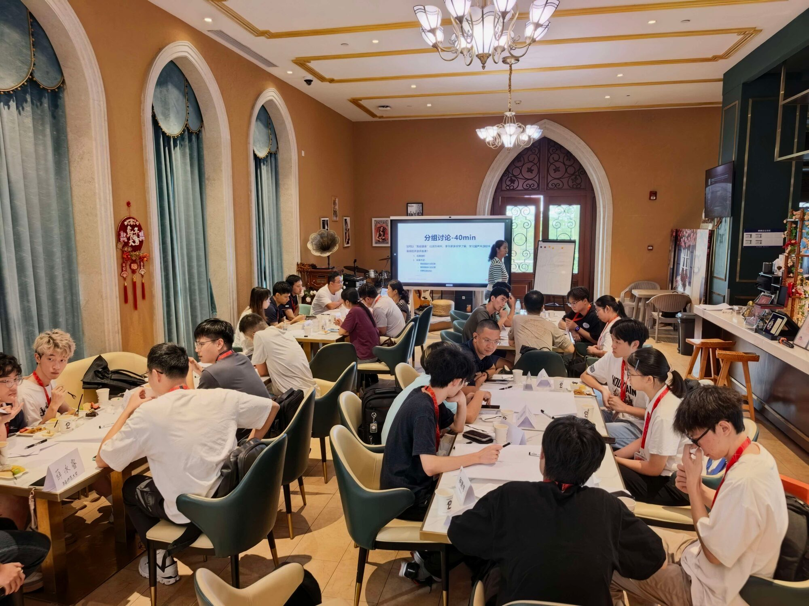
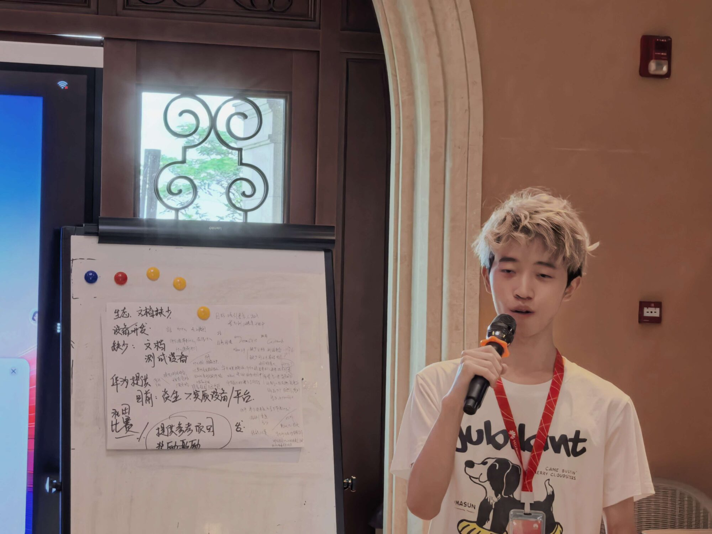

> _2026 年 9 月 12 日，华为溪流背坡村（东莞松山湖）_

9 月 12 日，哈尔滨工业大学（深圳）华为“智能基座”社团社长 XiC 与 StrayRN 二人赴华为溪村，参加 2026 年华南高校“智能基座”学生社团运营研讨会。来自华南地区 9 所入选教育部—华为“智能基座”试点建设清单高校的师生代表齐聚一堂，围绕社团建设与开源生态展开深入交流。

## 活动纪要

当日 14:00，各校代表在溪村 B 区门口集合，乘观光车进入园区，于溪村 B 区 B3 9410 咖啡厅享用了茶歇，并随即开启研讨会。

研讨会上，华为老师首先介绍了华南地区“智能基座”社团的工作总结与整体规划。华南区共有 9 所高校入选教育部—华为“智能基座”试点建设清单，包括广东工业大学、华南师范大学、深圳大学、桂林电子科技大学、暨南大学、中山大学、南方科技大学、华南理工大学以及哈尔滨工业大学（深圳），各校均派出学生与老师代表到场参会，大家首先进行了自我介绍。

随后，老师介绍了华为的开源生态与 AtomGit 开源社区，涵盖终端鸿蒙、鲲鹏通算、昇腾智算三大开源生态技术体系，并分享了 2026 年中国大学生创新创业大赛产业赛道的 104 道华为命题——其中 100 道命题基于 openHarmony、openEuler、openJiuwen、openPangu 四大国产开源技术，另有华为云与 IoT-鸿蒙智家两类产业应用技术命题。

在分组研讨环节，与会师生围绕 **社团招新**、**社团运营**、**高校开源开发者拓展** 三大议题展开热烈讨论，提出了许多富有建设性的意见和建议。我校 StrayRN 同学作为小组代表进行了分享发言。

研讨会结束后，师生们乘小火车游览溪村，沿途参观园区并合影留念，最后在湘汁源共进晚餐，活动在轻松愉快的氛围中圆满结束。

## 结语

本次研讨会为华南区各“智能基座”社团搭建了宝贵的交流平台。我社将借鉴各兄弟高校的优秀经验，进一步做好社团招新与运营工作，积极参与华为开源生态建设，助力更多同学了解国产开源技术、成长为优秀的开源开发者。

<RelatedLink
  href="./afterword/"
  description="后记 by X1c"
  label="前往松山湖……"
/>

