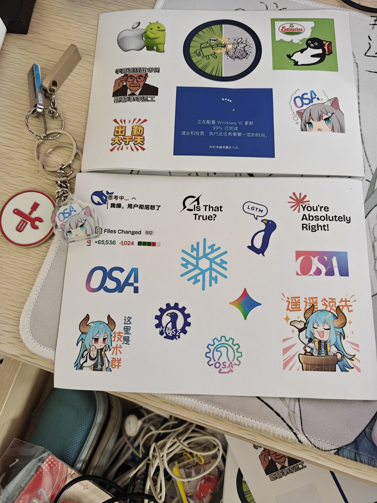
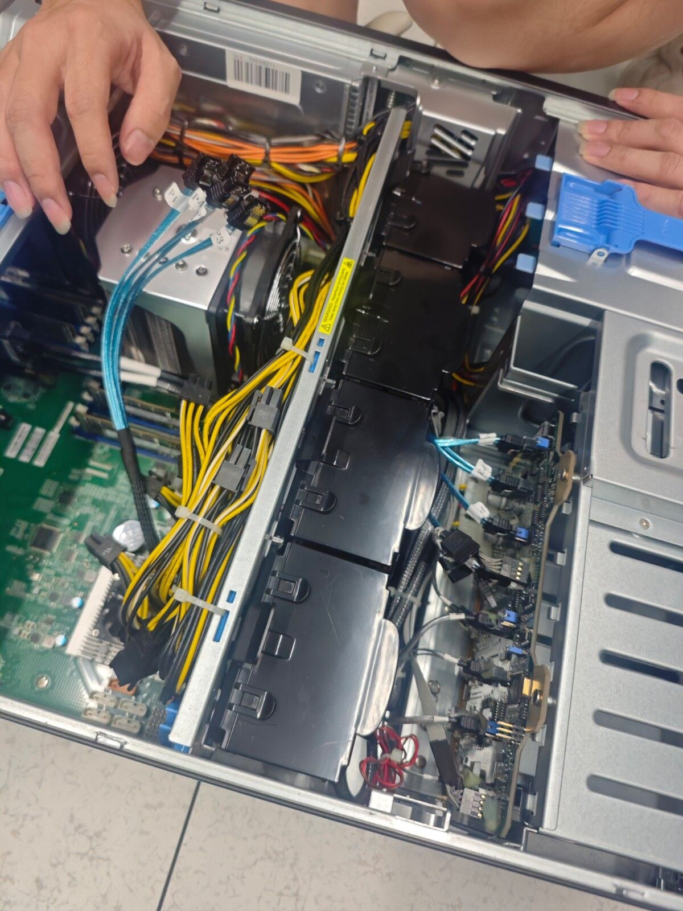
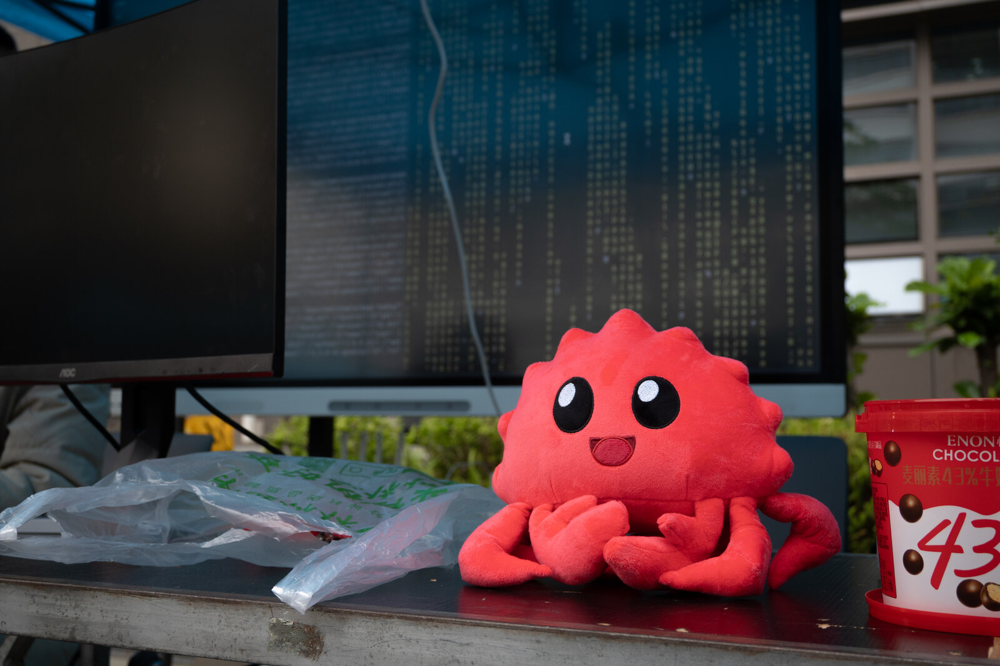
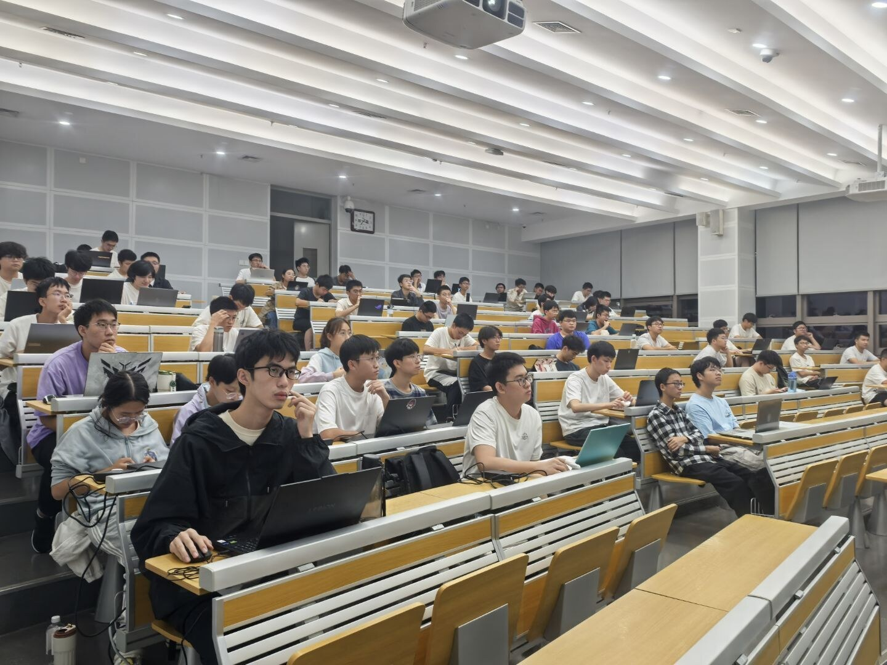
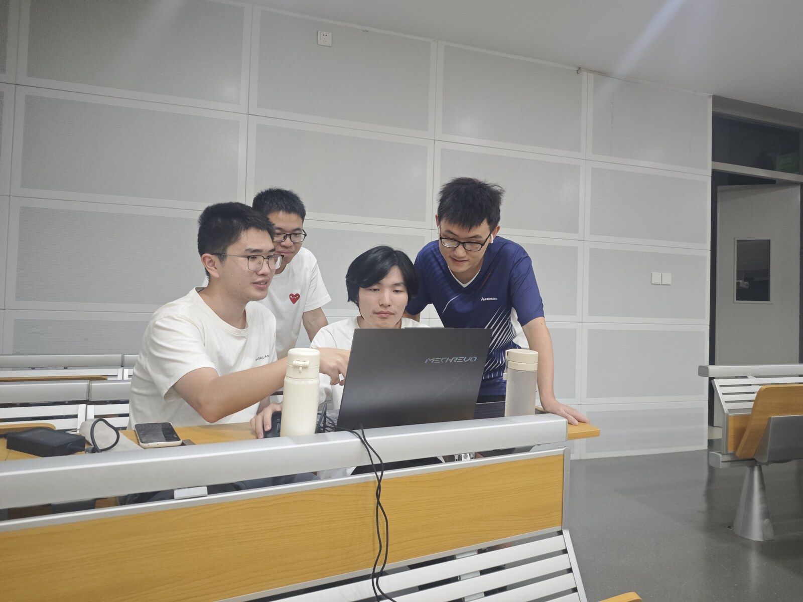
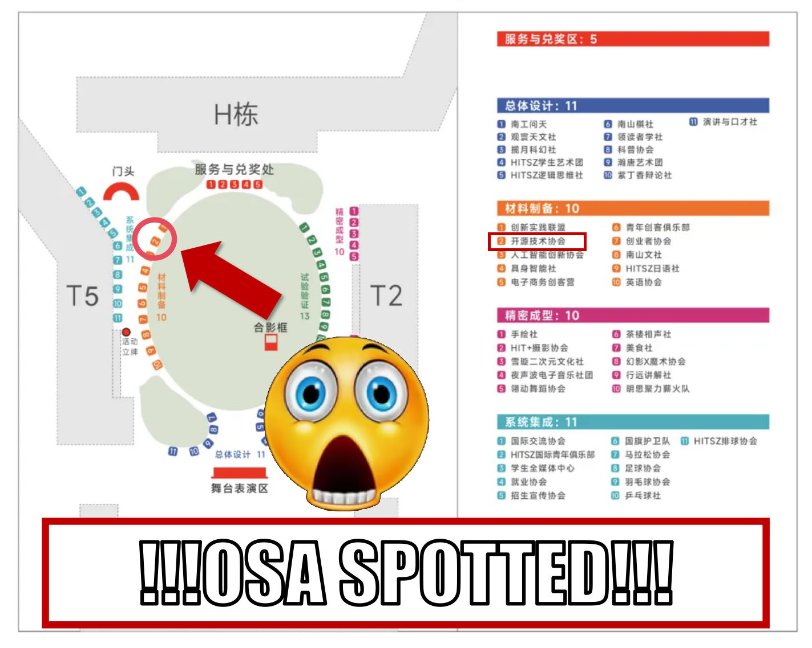
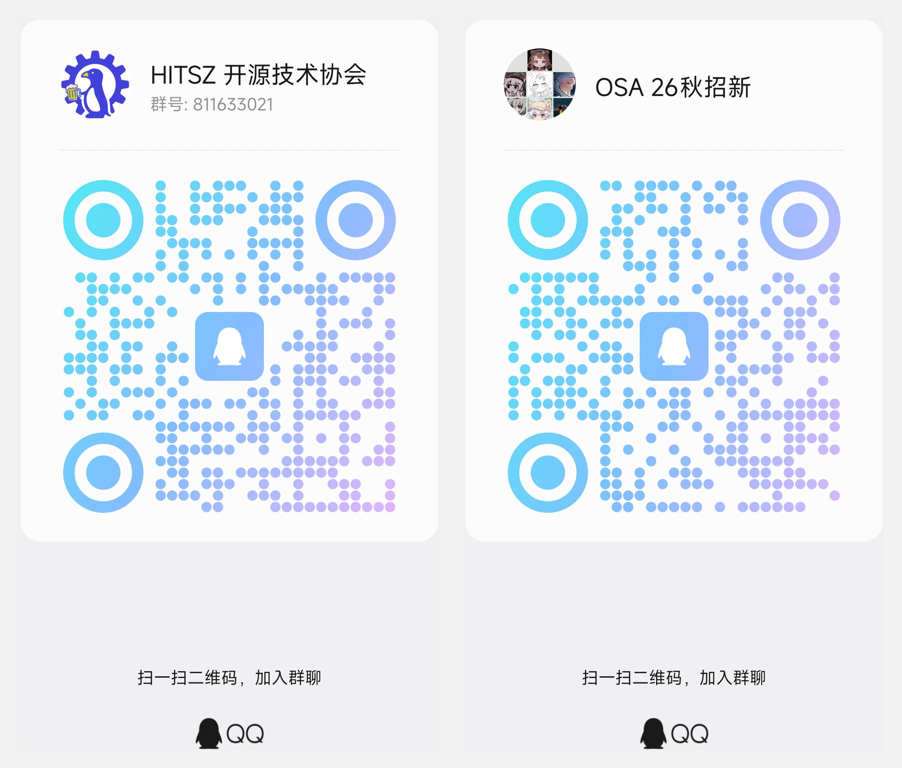

9 月 26 日（周六），开源技术协会将在游园会摆摊招新。我们把社员们平时倒腾的设备搬到了现场，还准备了一点小游戏、一点小惊喜……

## 我们是？

开源技术协会（OSA）是由哈尔滨工业大学（深圳）学生中的 Linux 用户和开源软件爱好者自发组建的学生社团。我们致力于维护学校的基础设施，提升学校开源氛围，为开源技术爱好者提供交流平台。

目前，OSA 负责的项目有：

- 校内镜像站：[mirrors.osa.moe](https://mirrors.osa.moe/)
- Grader 作业平台：[grader.hitsz.edu.cn](https://grader.hitsz.edu.cn/)
- 实验指导书平台：如 [CPU 设计指导书](https://cpu-design.p.cs-lab.top/)

等等，见 [关于](/about)。

欢迎广大同学积极体验、反馈，并共同参与到服务学校师生、交流发展技术爱好的过程中来。

## 摊位上有什么？

**Agent 共享画板**：现场小游戏——在共享画板上，每人贡献一句 prompt，交给 agent 接力作画，看看一张图最终会被大家“合谋”成什么样子。欢迎来留下属于你的那一笔。

**贴纸与钥匙扣**：社团周边免费领取，数量有限，先到先挑。

**设备试玩**：键盘、路由器、主机、开发板……社员们收藏的各类设备都在现场，可以上手把玩，还有 Linux 现场体验。

**免费 Codex**：先到先得。（未掺入代可可脂）

**招新 & Linux 101**：摊位备有海报与二维码，扫码关注招新安排，以及即将开讲的 Linux 101 系列讲座——全新大纲，从发行版科普到 AI 工具使用，敬请期待。

## OSA 在哪里？

~~nslookup www.osa.moe~~

请注意现场并没有巨大的红圈和箭头标示。

## 想提前了解我们？

无论你是对计算机技术有深入了解、强烈热忱的爱好者，还是只是模糊着想要学点什么的初学者、零基础同学，都欢迎加入我们的千人讨论大群：**811633021**。后续社团招新信息也会在讨论群公布，欢迎对 OSA 感兴趣的同学加入。

更多社团动态与开源项目，欢迎访问社团首页：[www.osa.moe](https://www.osa.moe/)

## 周六见

9 月 26 日，游园会，OSA 摊位——带着一句 prompt 的灵感来，也带走一枚贴纸（和一块 Codex）。
